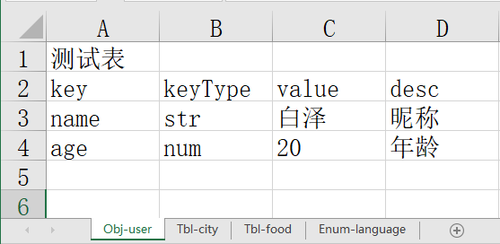
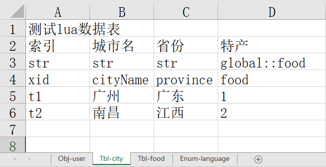
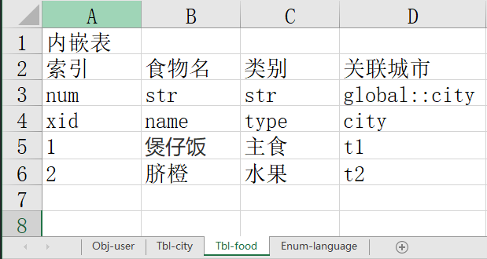
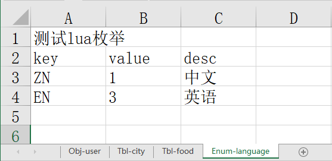

# xlsx 2 lua

## 导出类型

**1. Obj**

**2. Enum**

**3. Table**

## 数据类型

**1. num 数值**

**2. str 字符串**

**3. list-num 数组**

**4. list-str 数组**
**5. namespace::tblName 内嵌表 值为目标数据表的索引**

## excel规范

### xlsx文件命名

-   **[#] [首字字母大写+序号优先级] [xlsx文件]@命名空间**

-   **如M1-模型资源@res_model、T1-贴图资源@res_txture**

-   **以#开头忽略导出**

### Sheet命名

-   **[全英文]、[无空格]、[无特殊符号]、[驼峰命名]**
-   **类型-表名：比如: Obj-test、Enum-test、Tbl-test**

-   **以#开头忽略导出**

## Example

### E:\code\c#\xlsx-exporter\assets\测试@test.xlsx









### data\global\user.lua

```lua
--[[ E:/code/c#/xlsx-exporter/xlsx/测试.xlsx ]] --
-- 测试表
local XLSX_GLOBAL_USER = {
    -- 昵称
    name = '白泽',
    -- 年龄
    age = 20,
}
return XLSX_GLOBAL_USER

```

### data\global\language.lua

```lua
--[[ E:/code/c#/xlsx-exporter/xlsx/测试.xlsx ]] --
-- 测试lua枚举
local XLSX_GLOBAL_LANGUAGE = {
    -- 中文
    ZN = 1,
    -- 英语
    EN = 3,
}
return XLSX_GLOBAL_LANGUAGE

```

### data\global\food.lua

```lua
--[[ E:/code/c#/xlsx-exporter/xlsx/测试.xlsx ]] --
-- 内嵌表
local IFOOD = {
    -- 索引
    xid = 0,
    -- 食物名
    name = 1,
    -- 类别
    type = 2,
    -- 关联城市
    city = 3,
}
local XLSX_GLOBAL_FOOD = {
    [1] = {
        name = '煲仔饭',
        type = '主食',
        city = {
            cityName = '广州',
            province = '广东',
        },
    },
    [2] = {
        name = '脐橙',
        type = '水果',
        city = {
            cityName = '南昌',
            province = '江西',
        },
    },
}

setmetatable(XLSX_GLOBAL_FOOD, {
    __newindex = function(t, k, v)
    end
});

return XLSX_GLOBAL_FOOD

```

### data\global\city.lua

```lua
--[[ E:/code/c#/xlsx-exporter/xlsx/测试.xlsx ]] --
-- 测试lua数据表
local ICITY = {
    -- 索引
    xid = 0,
    -- 城市名
    cityName = 1,
    -- 省份
    province = 2,
    -- 特产
    food = 3,
}
local XLSX_GLOBAL_CITY = {
    [t1] = {
        cityName = '广州',
        province = '广东',
        food = {
            name = '煲仔饭',
            type = '主食',
        },
    },
    [t2] = {
        cityName = '南昌',
        province = '江西',
        food = {
            name = '脐橙',
            type = '水果',
        },
    },
}

return XLSX_GLOBAL_CITY

```


### xlsx.config.json配置文件

```json
{
	"SourcePath": "./xlsx", 	// xlsx目录 
	"ExportPath": "./data",		// lua导出目录
	"ExportFlags": "lua", 		// 导出类型
	"LuaConfig": {
		"DataTableFormat": "XLSX_{0}_{1}", 		// 导出数据表命名格式：XLSX_TEST_CITY
		"DataTableObjectFormat": "I{0}",		// 导出数据表对象命名格式：ICITY
		"LuaDefaultNameSpace": "global",		// 导出数据表默认命名空间：XLSX_GLOBAL_XX
		"NameSpaceRegex": "@\\s*([a-zA-Z_][a-zA-Z0-9_]*)?\\s*",		// xlsx文件名指定命名空间格式：C1-测试@test.xlsx
		"IgnoreXlsxRegex": "#.*",				// xlsx忽略导出：#C1-测试.xlsx
         "SheetRegex": "(Obj|Enum|Tbl)\\s*-\\s*([a-zA-Z_][a-zA-Z0-9_]*)",	// sheet命名格式：Tbl-city、Enum-city、Tbl-city
		"IgnoreSheetRegex": "#.*",				// sheet忽略导出：#Tbl-city
		"LuaTypes": {		// xlsx导出lua字段类型
			"Number": "num",		// 数值
			"String": "str",		// 字符串
			"ListNumber": "list:num", 		// 数值列表
			"ListString": "list:str",		// 字符串列表
			"InlineTable": "^([a-zA-Z_][a-zA-Z0-9_]*)\\s*::\\s*([a-zA-Z_][a-zA-Z0-9_]*)"		// lian'jie
		}
	}
}
```

## Release v2.0.1 exe下载
https://github.com/iCryingCat/xlsx/releases/download/v2.0.1/xlsx.v2.0.1.zip