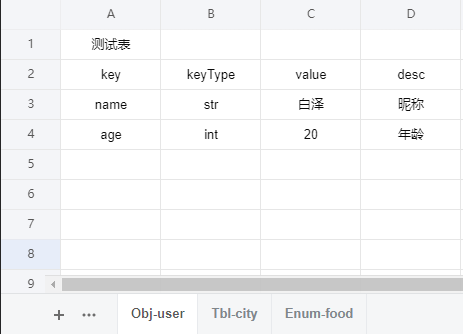
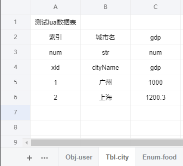
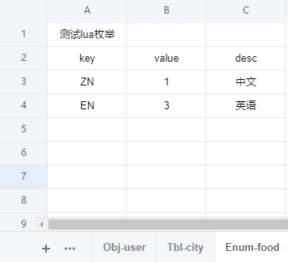

# xlsx 2 lua

## 导出类型

**1. Obj**

**2. Enum**

**3. Table**

## 数据类型

**1. num 数值**

**2. str 字符串**

**3. list-num 数组**

**4. list-str 数组**

## excel规范

### xlsx文件命名

-   **[#] [首字字母大写+序号优先级] [xlsx文件]@命名空间**

-   **如M1-模型资源@res_model、T1-贴图资源@res_txture**

-   **以#开头忽略导出**

### Sheet命名

-   **[全英文]、[无空格]、[无特殊符号]、[驼峰命名]**
-   **类型-表名：比如: Obj-test、Enum-test、Tbl-test**

-   **以#开头忽略导出**

## Example

### E:\code\c#\xlsx-exporter\assets\测试@test.xlsx







### E:\code\c#\xlsx-exporter\data\test\user.lua

```lua
--[[ E:/code/c#/xlsx-exporter/assets/测试@test.xlsx ]] --
-- 测试表
local XLSX_TEST_USER = {
    -- 昵称
    name = '白泽',
    -- 年龄
    age = 20,
}
return XLSX_TEST_USER
```

### E:\code\c#\xlsx-exporter\data\test\city.lua

```lua
--[[ E:/code/c#/xlsx-exporter/assets/测试@test.xlsx ]] --
-- 测试lua枚举
local XLSX_TEST_FOOD = {
    -- 中文
    ZN = 1,
    -- 英语
    EN = 3,
}
return XLSX_TEST_FOOD
```

### E:\code\c#\xlsx-exporter\data\test\food.lua

```lua
--[[ E:/code/c#/xlsx-exporter/assets/测试@test.xlsx ]] --
-- 测试lua数据表
local ICITY = {
    -- 索引
    xid = 0,
    -- 城市名
    cityName = 1,
    -- gdp
    gdp = 2,
}
local XLSX_TEST_CITY = {
    [1] = {
        cityName = '广州',
        gdp = 1000,
    },
    [2] = {
        cityName = '上海',
        gdp = 1200.3,
    },
}

return XLSX_TEST_CITY
```


### xlsx.config.json配置文件

```json
{
	"SourcePath": "./assets", 
	"ExportPath": "./data",
	"ExportFlags": "lua",
	"Namespace": "XLSX_{0}_{1}",
	"XlsxNameSpaceFlag": "@",
	"XlsxIgnoreFlag": "#",
	"SheetIgnoreFlag": "#",
	"SheetSepFlag": "-",
	"LuaTypes": {
		"Obj": "Obj",
		"Enum": "Enum",
		"Table": "Tbl"
	},

	"LuaDataModel": "I{0}"
}

```

-   **SourcePath：xlsx目录相对路径**
-   **ExportPath：导出lua相对路径**
-   **ExportFlags：需要导出的格式**
-   **Namespace：命名空间格式：XLSX_[xlsx文件@对应的命名空间]_[sheet名]**
-   **XlsxNameSpaceFlag：xlsx文件命名空间标识**
-   **XlsxIgnoreFlag：xlsx忽略导出标识**
-   **SheetSepFlag：sheet名类型分隔符**
-   **LuaTypes：sheet名指定的lua类型**
-   **LuaDataModel：导出lua数据表的表对象命名格式**

## exe下载
Release v1.0.1：https://github.com/iCryingCat/xlsx/releases/download/v1.0.1/xlsx.zip