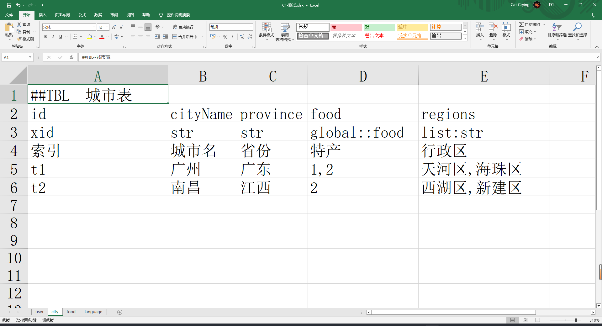

# xlsx 2 lua

## 导出类型

**1. Obj**


**2. Enum**


**3. Table**



## 数据类型

**1. num 数值**

**2. str 字符串**

**3. list-num 数组**

**4. list-str 数组**

**5. xid 数据表索引**

**6. namespace::tblName 内嵌表 值为目标数据表的索引**

## excel规范

### xlsx文件命名

-   **[#] [首字字母大写+序号优先级] [xlsx文件]@命名空间**

-   **如M1-模型资源@res_model、T1-贴图资源@res_txture**

-   **以#开头忽略导出**

### Sheet命名

-   **[全英文]、[无空格]、[无特殊符号]、[驼峰命名]**
-   **类型-表名：比如: city、user**

-   **以#开头忽略导出**

### 数据表

-   **以：##[表类型]–[表注释]  为数据表开始行列，备注内容只能存在于左上角，且备注行、列不能超过数据表最大行、列**

## Example

#### ./xlsx/C1-测试.xlsx


### Lua

#### data/lua/global/user.lua

```lua
-- 测试.xlsx
-- 用户表
local XLSX_GLOBAL_USER = {
    -- 昵称
    name = '白泽',
    -- 年龄
    age = 20,
}
return XLSX_GLOBAL_USER

```

#### data/lua/global/city.lua

```lua
-- 测试.xlsx
--[[
local ICITY = {
-- 索引
id = 0,
-- 城市名
cityName = 1,
-- 省份
province = 2,
-- 特产
food = 3,
-- 行政区
regions = 4,
}
--]]

-- 城市表
local XLSX_GLOBAL_CITY = {
    ['t1'] = {
        cityName = '广州',
        province = '广东',
        food = {
            [1] = {
                name = '煲仔饭',
                type = '主食',
            },
            [2] = {
                name = '脐橙',
                type = '水果',
            },
        },
        regions = {
            [0] = '天河区',
            [1] = '海珠区',
        },
    },
    ['t2'] = {
        cityName = '南昌',
        province = '江西',
        food = {
            [2] = {
                name = '脐橙',
                type = '水果',
            },
        },
        regions = {
            [0] = '西湖区',
            [1] = '新建区',
        },
    },
}

return XLSX_GLOBAL_CITY

```

#### data/lua/global/food.lua

```lua
-- 测试.xlsx
--[[
local IFOOD = {
-- 索引
id = 0,
-- 食物名
name = 1,
-- 类别
type = 2,
-- 关联城市
city = 3,
}
--]]

-- 特产表
local XLSX_GLOBAL_FOOD = {
    ['1'] = {
        name = '煲仔饭',
        type = '主食',
        city = {
            [t1] = {
                cityName = '广州',
                province = '广东',
                regions = {
                    [0] = '天河区',
                    [1] = '海珠区',
                },
            },
        },
    },
    ['2'] = {
        name = '脐橙',
        type = '水果',
        city = {
            [t2] = {
                cityName = '南昌',
                province = '江西',
                regions = {
                    [0] = '西湖区',
                    [1] = '新建区',
                },
            },
        },
    },
}

return XLSX_GLOBAL_FOOD

```

#### data/lua/global/language.lua

```lua
-- 测试.xlsx
-- 语言表
local XLSX_GLOBAL_LANGUAGE = {
    -- 中文
    ZN = 1,
    -- 英语
    EN = 3,
}
return XLSX_GLOBAL_LANGUAGE

```

  

### CS

#### data/lua/global/user.cs

```csharp
namespace XLSX.GLOBAL
{
    // 用户表
    public class USER
    {
        // 昵称
        public string name { get; set; }
        // 年龄
        public float age { get; set; }

    }

}

```

#### data/lua/global/city.cs

```csharp
using XLSX.GLOBAL;
namespace XLSX.GLOBAL
{
    // 城市表
    public class CITY
    {
        // 索引
        public string id { get; set; }
        // 城市名
        public string cityName { get; set; }
        // 省份
        public string province { get; set; }
        // 特产
        public XLSX.GLOBAL.FOOD food { get; set; }
        // 行政区
        public List<string> regions { get; set; }

    }

}

```

#### data/lua/global/food.cs

```csharp
using XLSX.GLOBAL;
namespace XLSX.GLOBAL
{
    // 特产表
    public class FOOD
    {
        // 索引
        public string id { get; set; }
        // 食物名
        public string name { get; set; }
        // 类别
        public string type { get; set; }
        // 关联城市
        public XLSX.GLOBAL.CITY city { get; set; }

    }

}

```

####   data/lua/global/language.cs

```csharp
namespace XLSX.GLOBAL
{
    // 语言表
    public enum LANGUAGE
    {
        // 中文
        ZN = 1,
        // 英语
        EN = 3,

    }

}

```

  

### Json

####   data/lua/global/user.lua

```json
{
	"XLSX_GLOBAL_USER": {
		"name": "白泽",
		"age": 20
	}
}

```

####   data/lua/global/city.json

```json
{
	"XLSX_GLOBAL_CITY": {
		"t1": {
			"cityName": "广州",
			"province": "广东",
			"food": {
				"1": {
					"name": "煲仔饭",
					"type": "主食"
				},
				"2": {
					"name": "脐橙",
					"type": "水果"
				}
			},
			"regions": ["天河区", "海珠区"]
		},
		"t2": {
			"cityName": "南昌",
			"province": "江西",
			"food": {
				"2": {
					"name": "脐橙",
					"type": "水果"
				}
			},
			"regions": ["西湖区", "新建区"]
		}
	}
}

```

####   data/lua/global/food.json

```json
{
	"XLSX_GLOBAL_FOOD": {
		"1": {
			"name": "煲仔饭",
			"type": "主食",
			"city": {
				"t1": {
					"cityName": "广州",
					"province": "广东",
					"regions": ["天河区", "海珠区"]
				}
			}
		},
		"2": {
			"name": "脐橙",
			"type": "水果",
			"city": {
				"t2": {
					"cityName": "南昌",
					"province": "江西",
					"regions": ["西湖区", "新建区"]
				}
			}
		}
	}
}

```

####   data/lua/global/language.json

```json
{
	"XLSX_GLOBAL_LANGUAGE": {
		"ZN": 1,
		"EN": 3
	}
}

```

### xlsx.config.json

```json
{
	"Xlsx": "./xlsx",
	"ExportCmd": "cs|lua|json",
	"XlsxTypeRegex": "##(TBL|ENUM|OBJ)-{0,}(.*)",
	"LuaDefaultNameSpace": "global",
	"NameSpaceRegex": "@\\s*([a-zA-Z_][a-zA-Z0-9_]*)?\\s*",
	"IgnoreXlsxRegex": "#.*",
	"IgnoreSheetRegex": "#.*",
	"XlsxTypes": {
		"Number": "num",
		"String": "str",
		"ListNumber": "list:num",
		"ListString": "list:str",
		"ListSeparator": ",",
		"Xid": "xid",
		"InlineTable": "^([a-zA-Z_][a-zA-Z0-9_]*)\\s*::\\s*([a-zA-Z_][a-zA-Z0-9_]*)"
	},
	"LuaConfig": {
		"DeclareJson": "./xlsx.d.json",
		"ExportTo": "./data/lua",
		"Externion": ".lua",
		"PackageFormat": "XLSX_{0}_{1}",
		"PackageObjectFormat": "I{0}"
	},
	"JsonConfig": {
		"ExportTo": "./data/json",
		"Externion": ".json",
		"PackageFormat": "XLSX_{0}_{1}"
	},
	"CSConfig": {
		"ExportTo": "./data/cs",
		"Externion": ".cs",
		"PackageFormat": "XLSX.{0}"
	}
}
```


## u2xlsx v3.0.1 exe下载

https://github.com/iCryingCat/xlsx/releases/download/v3.0.1/xlsx.v3.0.1.zip